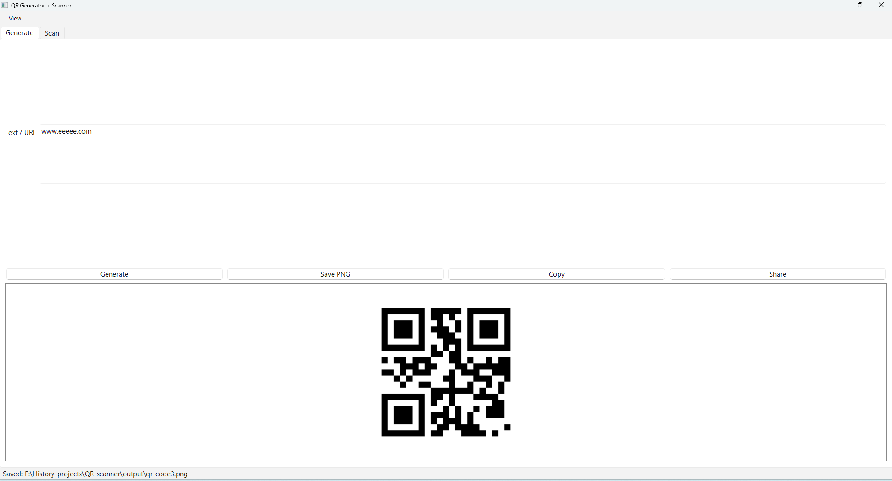
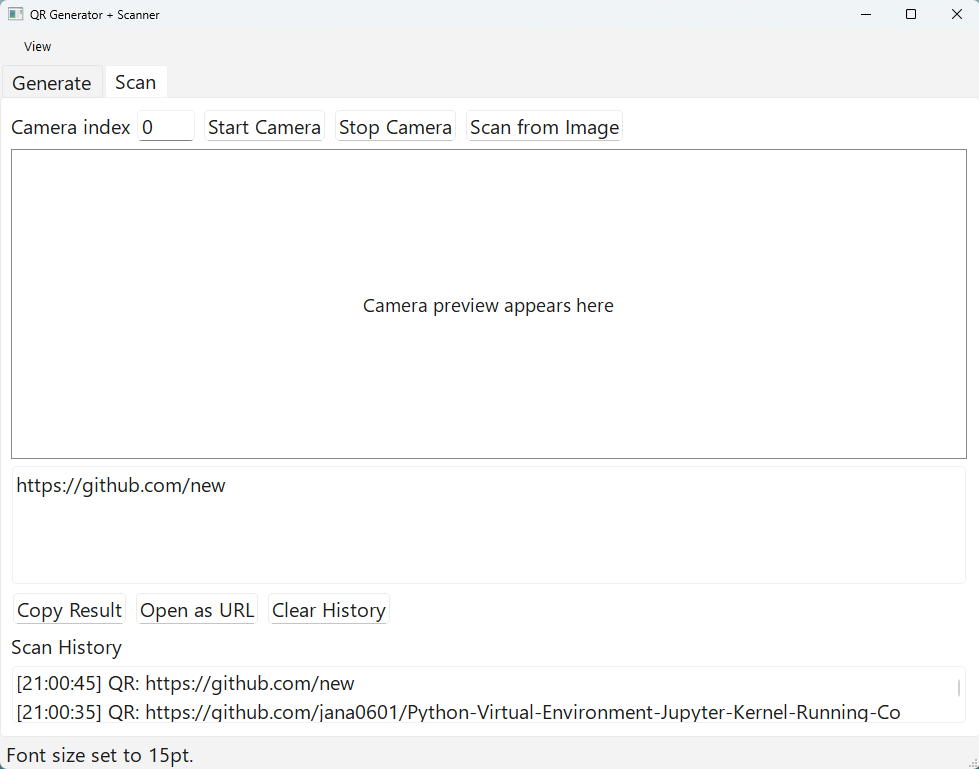

# QR Generator + Scanner (Windows)

Desktop app to generate and scan QR codes with a clean Windows UI.
The application can be download in:
https://drive.google.com/file/d/1ziMTezFzFvodWUeilhxd_PsT14uGAm2H/view?usp=sharing

## Layout Preview




## Features

- Generate QR codes from text or URL
- Save generated QR code as PNG
- Copy generated QR image to clipboard
- Share generated QR with options for Open With, Email (attachment via Outlook), or folder view
- Scan QR using webcam
- Scan QR from image files
- Copy scan result and open result as URL
- View scan history with timestamps
- Clear scan history with one click

## Requirements

- Windows 10/11
- Python 3.11+
- Webcam (for camera scanning feature)

## Setup

```bash
python -m venv .venv
.venv\Scripts\activate
pip install -r requirements.txt
```

## Run

```bash
python app.py
```

## User Manual

### Generate QR

1. Open the **Generate** tab.
2. Enter text or a URL.
3. Click **Generate** to preview the QR code.
4. Use:
   - **Save PNG** to export the QR image.
   - **Copy** to copy the QR image directly to clipboard.
   - **Share** to choose a share method:
     - **Open With (choose app)**
     - **Email** (creates Outlook draft with QR image attached)
     - **Open Containing Folder**

### Scan QR

1. Open the **Scan** tab.
2. Use one of the scan methods:
   - **Start Camera** for live scanning.
   - **Scan from Image** to decode from an existing image file.
3. Decoded values appear in the result box and scan history.
4. Use:
   - **Copy Result** to copy decoded text.
   - **Open as URL** when result is a web link.
   - **Clear History** to remove all past results.

## Build EXE (PyInstaller)

Install PyInstaller:

```bash
pip install pyinstaller
```

Build:

```bash
pyinstaller --noconfirm --onefile --windowed --name QRScanner --exclude-module PyQt5 --exclude-module PyQt6 --exclude-module PySide2 app.py
```

Output executable:

- `dist\QRScanner.exe`

## Troubleshooting

- If Email share does not open a draft with attachment:
  - Make sure Microsoft Outlook desktop is installed and configured.
- If camera fails to open:
  - Check Windows Camera privacy settings for desktop apps.
  - Try a different camera index in the app (`0`, `1`, `2`).
- If QR decoding from camera is inconsistent:
  - Increase lighting and hold QR steady in frame.
- If `pyzbar` cannot decode on your machine:
  - The app automatically falls back to OpenCV QR decoding.
